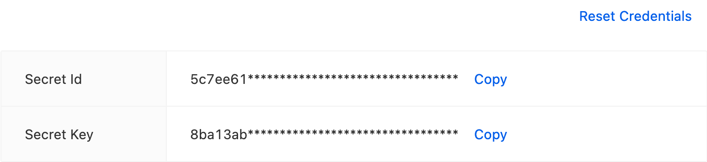

## Retter.io Command Line Tool

Rio Command Line Tool

### Installation

```shell
npm i -g @retter/rio-cli
```

### Before Starting

``Rbs Console > Right Top Dropdown Menu > Settings``


---
**NOTE**

You should set the admin profile using above credentials by ```rio set-profile``` command

---

#### Example:

```shell
rio set-profile --profile-name PROFILE_NAME --secret-id SECRET_ID --secret-key SECRET_KEY --endpoint RIO_ENDPOINT
rio list-profiles
```

### Project Initialization

``rio init``

Create a new project

```shell
rio init PROJECT_ALIAS
```

``rio generate``

Create the rio file for each of classes

```shell
rio generate
```

#### Example:

```shell
rio init TEST
cd TEST
rio generate # optional
rio deploy
```

### Project Deployment

```shell
rio deploy
rio d --profile PROFILE --project-id PROJECT_ID --classes CLASSES --ignore-approval --skip-diff-check --force
```
